# Recipe and Shopping List App

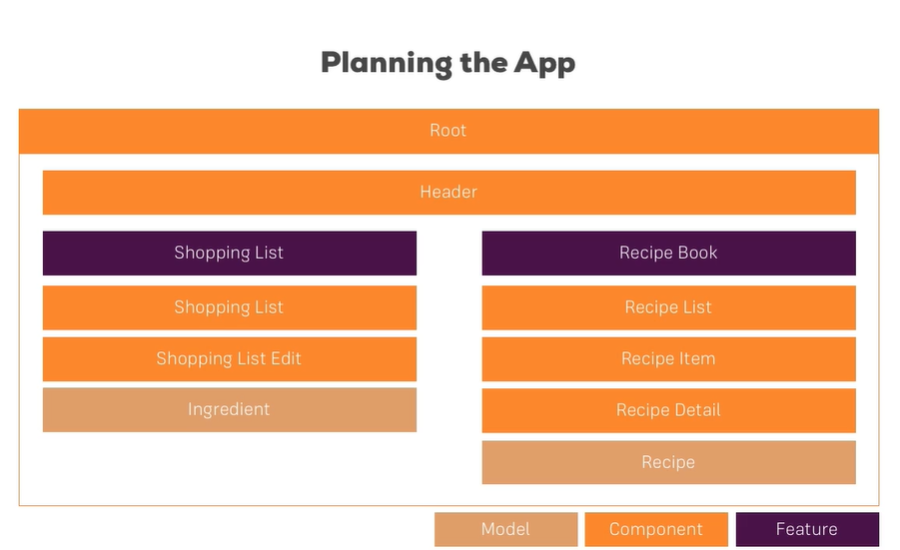

Make sure, you do create that app by also adding the --no-strict flag to the ng new command - otherwise you will run into issues later on (we'll still dive into that "Strict Mode" later in the course of course, no worries)!

We'll also install the Bootstrap CSS Framework and in this course, we use version 3 of the framework. Install it via npm install --save bootstrap@3 => The @3 is important!

Additionally, when using a project created with Angular CLI 6+ (check via ng v ), you'll have an angular.json file instead of an .angular-cli.json file. In that file, you still need to add Bootstrap to the styles[] array as shown in the next video, but the path should be node_modules/bootstrap/dist/css/bootstrap.min.css , NOT ../node_modules/bootstrap/dist/css/bootstrap.min.css. The leading ../ must not be included.

--------------

*In the video 'Creating the Components' there is a chyron that pops up to say a command has changed to skipTests true instead of --spec false that Max uses. The actual new command is --skip-tests true with a hyphen between the words. ng g c componentname --skip-tests true*

### Adding a Navigation Bar

The way we added it, the Navbar will collapse on smaller screens. Since we didn't implement a Hamburger menu, that means that there's no way of accessing our links on smaller screens.

You can either add such a menu on your own (see below), or you replace collapse navbar-collapse with just navbar-default in the CSS class list in the HTML code.

### Adding a Hamburger Menu:

Alternatively, if you want to make the navigation bar responsive, please replace these lines in header.component.html:

    

    <a routerLink="/" class="navbar-brand">Recipe Book</a>
    

    

with these lines:

    

    <button type="button" class="navbar-toggle" (click)="collapsed = !collapsed">
        
    </button>
    <a routerLink="/" class="navbar-brand">Recipe Book</a>
    

    

and add this line to header.component.ts:

    collapsed = true;

Allows us to repeat code:

*ngFor=""

Example:

<a href="#" class="list-group-item clearfix" *ngFor="let recipe of recipes">

src="{{ }}" <-- String Interpolation

[src]="" <-- Property Binding

BOTH String Interpolation and Property Binding
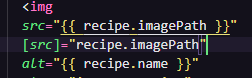

### Finished Result

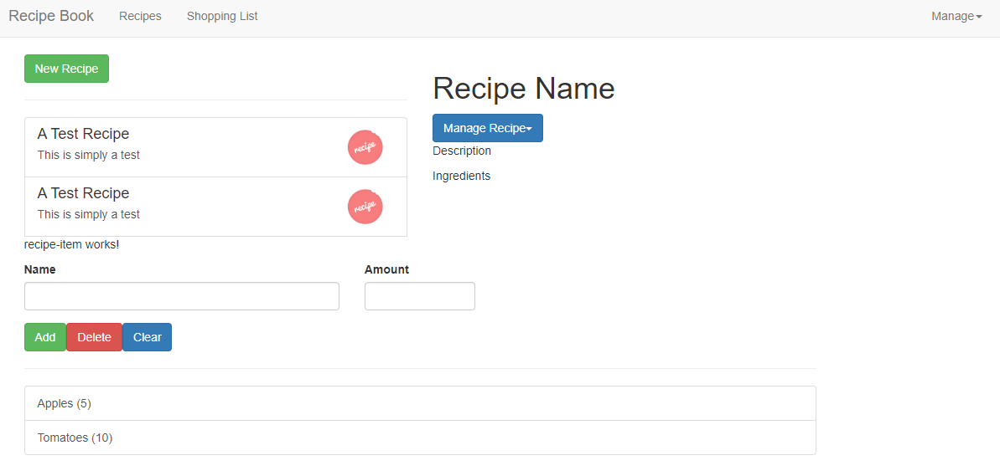

### Shared Items

These two are the same thing

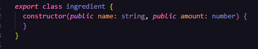

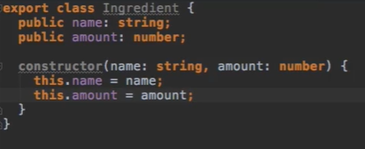

## Understanding Errors

- Try opening the Console to read what the error might be
- CHECK your "divs"
- Check at runtime why it's not working:
    - chrome
    - sources
    - check the script bundles (try main bundle first)
    - Can directly access TS files via Webpack. So you don't need to dig through all of that bundled code!

## Understanding Directives

Attribute vs Structural

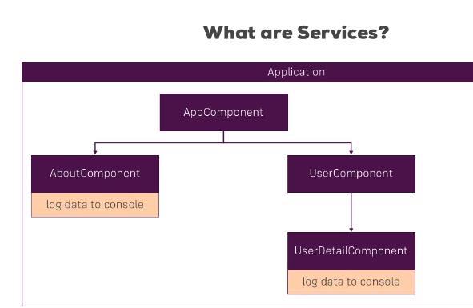

## What are Services?

## Adding Servies

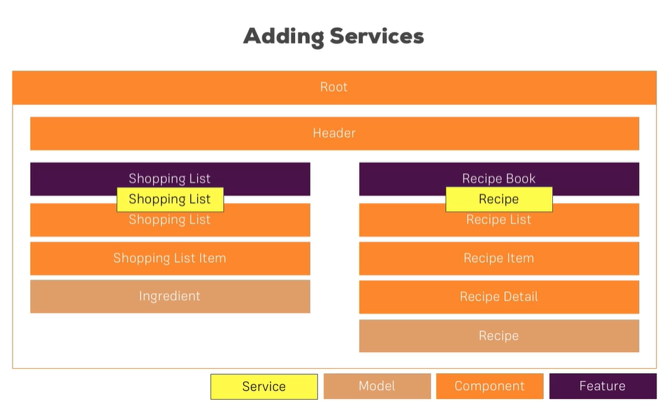

## Planning the General Structure

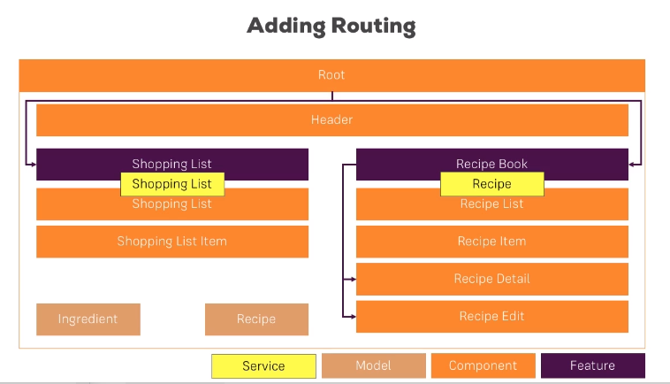

## Setting up Routes

See if it's a pre-fix word path...

## Marking Active Routes

Oh! This highlights the tabs at the top :)

## Fixing Page Reload Issues

Added a cursor pointer to all of the boxes that are "clickable".

## Child Routes
## Configuring Route Parameters
## Passing Dynamic Parameters to Links
## Styling Active Recipe Items

## Adding Editing Routes

These NEED to be in a very precise order...

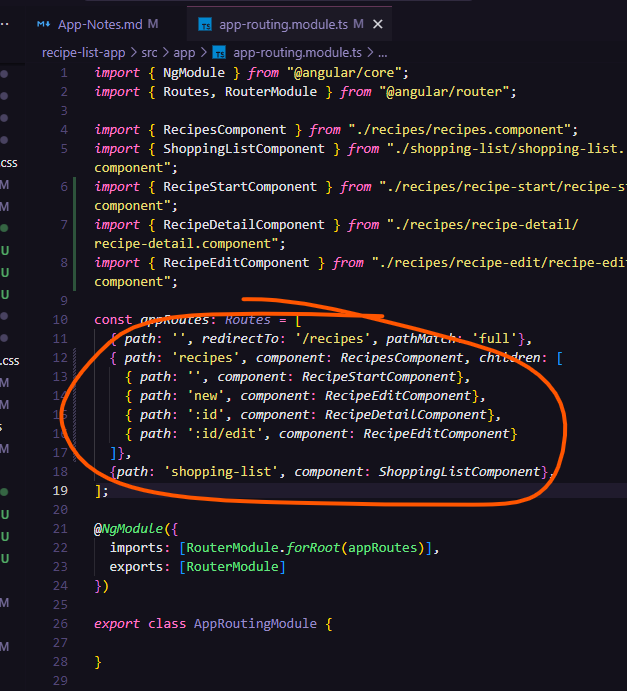

## Retrieving Route Parameters

So now we are able to tell if we are in edit mode for the recipe pages

## Programmatic Navigation to the Edit Page/ Cleanup

We now have buttons that go to another page for editing the material. Cannot edit said material just yet..

## Improving the Reactive Service with Observables (Subjects)

## TD: Adding the Shopping List Form

Need to add a form when you add a recipe and in the shopping list!

## Adding validation to the form

## Allowing the Selection of items in the list

## Loading the shopping list items into the form

*there is a bug here, when I click on an item, it does not update on the input portion of the form*

## Updating existing items

## Resetting the Form

## Allowing the user to clear (cancel) the form

*Noticed here that I also can't clear the form. That same bug must have something to do with submission/the form itself! <-- NEVERMIND! I forgot paranthesis again

## Allowing the deletion of shopping list items

## Creating the Template for the (Reactive) Recipe Edit Form

## Syncing HTML with the Form

## Adding Ingredient Controls to a Form Array

In this lecture, we'll add some code to access the controls of our form array:

*ngFor="let ingredientCtrl of recipeForm.get('ingredients').controls; let i = index"

This code will fail with the latest Angular version.

You can fix it easily though. Outsource the "get the controls" logic into a getter of your component code (the .ts file):

get controls() { // a getter!
  return (<FormArray>this.recipeForm.get('ingredients')).controls;
}
In the template, you can then use:

*ngFor="let ingredientCtrl of controls; let i = index"

This adjustment is required due to the way TS works and Angular parses your templates (it doesn't understand TS there).

## Adding new Ingredient Controls

## Validating User Input

## Submitting the Recipe Edit Form

There's an error here, can't add new stuff! Also the red error boxes do not show up with creating a new recipe...

## Adding a Delete and Clear (Cancel) Functionality

*************************
# Things to Fix
*************************

----------OPEN BUGS----------

5. Found in "Submitting the Recipe Edit Form"

There's an error here, can't add new stuff! Also the red error boxes do not show up with creating a new recipe...

----------CLOSED BUGS----------

1. When you click on the "Test Recipe" icon it does not preview the recipe
    2. Underneath this error, we need to test the dropdown beneath it to make sure it works!

*Solution:*

Somewhere between THESE two videos an error occured to where pressing on the Recipe Button does not show the recipe...

*Rewatched Displaying Recipe Details*
*Passing Data with Event and Property Binding (Combined)*

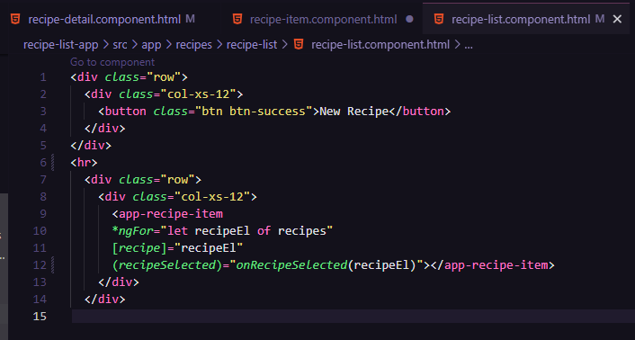

I didn't specify pass the recipeEl element!! It works now. Drop down also works!
---------------------------

2. Shopping list won't itemize any ingredients I put in manually

Errors listed:

- When I click on the Shopping List tab (core.mjs:10592 )

- When I try to add an ingredient (shopping-edit.component.html:25)

*Solution:*

- I got the adding single ingredients to work, now need to fix adding from the recipes list (had an @ symbol instead of a #)

Oh wow! Found another issue, where it wasn't even listing the ingredients, this is now fixed

-Update: Found the error! It was missing a set of parenthesis on the click action for the button!

---------------------------

3. Found in "Loading the shopping list items into the form"

when I click on an item, it does not update on the input portion of the form

*Solution*

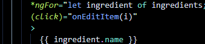

I didn't add parenthesis to the click listener. Learning I have a weakness with these...

*Noticed that I also can't clear the form. That same bug must have something to do with submission/the form itself! <-- NEVERMIND! I forgot paranthesis again

---------------------------

4. Found in "Adding new Ingredient Controls"

I messed up my divs and now one is out of place and is wrecking my form!

*Solution:*

I had to fix the col-xs-12 around line 56!! And delete a few divs...