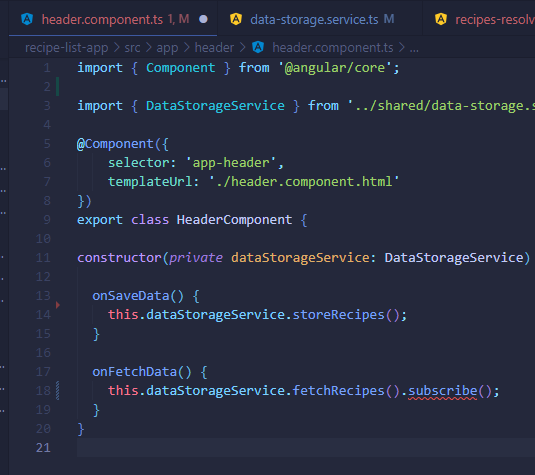

# Recipe and Shopping List App

Make sure, you do create that app by also adding the --no-strict flag to the ng new command - otherwise you will run into issues later on (we'll still dive into that "Strict Mode" later in the course of course, no worries)!

We'll also install the Bootstrap CSS Framework and in this course, we use version 3 of the framework. Install it via npm install --save bootstrap@3 => The @3 is important!

Additionally, when using a project created with Angular CLI 6+ (check via ng v ), you'll have an angular.json file instead of an .angular-cli.json file. In that file, you still need to add Bootstrap to the styles[] array as shown in the next video, but the path should be node_modules/bootstrap/dist/css/bootstrap.min.css , NOT ../node_modules/bootstrap/dist/css/bootstrap.min.css. The leading ../ must not be included.

--------------

*In the video 'Creating the Components' there is a chyron that pops up to say a command has changed to skipTests true instead of --spec false that Max uses. The actual new command is --skip-tests true with a hyphen between the words. ng g c componentname --skip-tests true*

### Adding a Navigation Bar

The way we added it, the Navbar will collapse on smaller screens. Since we didn't implement a Hamburger menu, that means that there's no way of accessing our links on smaller screens.

You can either add such a menu on your own (see below), or you replace collapse navbar-collapse with just navbar-default in the CSS class list in the HTML code.

### Adding a Hamburger Menu:

Alternatively, if you want to make the navigation bar responsive, please replace these lines in header.component.html:

    

    <a routerLink="/" class="navbar-brand">Recipe Book</a>
    

    

with these lines:

    

    <button type="button" class="navbar-toggle" (click)="collapsed = !collapsed">
        
    </button>
    <a routerLink="/" class="navbar-brand">Recipe Book</a>
    

    

and add this line to header.component.ts:

    collapsed = true;

Allows us to repeat code:

*ngFor=""

Example:

<a href="#" class="list-group-item clearfix" *ngFor="let recipe of recipes">

src="{{ }}" <-- String Interpolation

[src]="" <-- Property Binding

BOTH String Interpolation and Property Binding

### Finished Result

### Shared Items

These two are the same thing

## Understanding Errors

- Try opening the Console to read what the error might be
- CHECK your "divs"
- Check at runtime why it's not working:
    - chrome
    - sources
    - check the script bundles (try main bundle first)
    - Can directly access TS files via Webpack. So you don't need to dig through all of that bundled code!

## Understanding Directives

Attribute vs Structural

## What are Services?

## Adding Servies

## Planning the General Structure

## Setting up Routes

See if it's a pre-fix word path...

## Marking Active Routes

Oh! This highlights the tabs at the top :)

## Fixing Page Reload Issues

Added a cursor pointer to all of the boxes that are "clickable".

## Child Routes
## Configuring Route Parameters
## Passing Dynamic Parameters to Links
## Styling Active Recipe Items

## Adding Editing Routes

These NEED to be in a very precise order...

## Retrieving Route Parameters

So now we are able to tell if we are in edit mode for the recipe pages

## Programmatic Navigation to the Edit Page/ Cleanup

We now have buttons that go to another page for editing the material. Cannot edit said material just yet..

## Improving the Reactive Service with Observables (Subjects)

## TD: Adding the Shopping List Form

Need to add a form when you add a recipe and in the shopping list!

## Adding validation to the form

## Allowing the Selection of items in the list

## Loading the shopping list items into the form

*there is a bug here, when I click on an item, it does not update on the input portion of the form*

## Updating existing items

## Resetting the Form

## Allowing the user to clear (cancel) the form

*Noticed here that I also can't clear the form. That same bug must have something to do with submission/the form itself! <-- NEVERMIND! I forgot paranthesis again

## Allowing the deletion of shopping list items

## Creating the Template for the (Reactive) Recipe Edit Form

## Syncing HTML with the Form

## Adding Ingredient Controls to a Form Array

In this lecture, we'll add some code to access the controls of our form array:

*ngFor="let ingredientCtrl of recipeForm.get('ingredients').controls; let i = index"

This code will fail with the latest Angular version.

You can fix it easily though. Outsource the "get the controls" logic into a getter of your component code (the .ts file):

get controls() { // a getter!
  return (<FormArray>this.recipeForm.get('ingredients')).controls;
}
In the template, you can then use:

*ngFor="let ingredientCtrl of controls; let i = index"

This adjustment is required due to the way TS works and Angular parses your templates (it doesn't understand TS there).

## Adding new Ingredient Controls

## Validating User Input

## Submitting the Recipe Edit Form

There's an error here, can't add new stuff! Also the red error boxes do not show up with creating a new recipe...

## Adding a Delete and Clear (Cancel) Functionality

## Redirecting the User (after Deleting a Recipe)

## Adding an Image Preview (back in)

Strange! Noticing here if I try to delete an ingredient it circles me back to the recipe page listing the ingredients...

## Providing the Recipe Service Correctly

## Deleting Ingredients and Some Finishing Touches

## Deleting all items in a formarray

As of Angular 8+, there's a new way of clearing all items in a FormArray.

(<FormArray>this.recipeForm.get('ingredients')).clear();
The clear() method automatically loops through all registered FormControls (or FormGroups) in the FormArray and removes them.

It's like manually creating a loop and calling removeAt() for every item.

## Module Introduction to Http

## Backend (Firebase) Setup

## Setting up the DataStorage Service

## Storing Recipes

Group all of the angular imports together. Makes it easier when they are categorized.

## Fetching Recipes

## Transforming Response Data

## Resolving Data Befpre Loading

## Fixing a Bug with the Resolver

*Help. I deleted my recipes and now they won't come back...*

## How Authentication Works

## Adding the Auth Page

## Switching Between Auth Modes

## Handling Form Input

This gives you access to the Angular Form object

How to sign up new users and log them in...

## Preparing the Backend

You don't technically need just Firebase, you can use multiple things to get a backend to a site.

## Adding a Loading Spinner & Error Handling Logic

OOOOH! Loading.io has super cool CSS animations.

https://loading.io/css/

## Improving Error Handling

## Sending Login Requests

## Login Error Handling

## Creating & Storing the User Data

## Reflecting the Auth State in the UI

... now it's not working because of more deprications... i'll fix this later. Just going to finish then I'll figure out how to update this.

## Adding the Token to Outgoing Requests

## Attaching the Token with an Interceptor

## Adding Logout

## Adding Auto-Login

## Adding Auto-Logout

## Adding an Auth Guard

## WRap Up

- added an offservice to our A, to manage frontend auth needs.
- sign user up and sign them in
- switching between sign up and signin
- storing a token after successful login, and persists with reload
- use token to fetch and save data

- Firebase is JUST one example. Expires in an hour. Process of tokens is pretty much the same. You want to store in a place that survives reloads

- And make sure it clears once it's expired

- Using routing guard against unauth access (you need to login to view recipes)

## Useful Resources & Links

Useful Docs:

Firebase Auth REST API Docs: https://firebase.google.com/docs/reference/rest/auth
More on JWT: https://jwt.io 

## Intro to Dynamic Components

Not a specific feature but we can load components through our code?

How to load and communicate and get rid of it in the code

## Adding an Alert Modal Component

Made an alert Pop-up

## Understanding the Different Approaches

## Using ngIf

We added the alert box

## Preparing Programmatic Creation

NOW FORGET THIS, WE'RE DOING THIS ANOTHER WAY!

Not this either, because it is not written for Angular

## Creating a Component Programmatically

## Understanding entryComponents

1st place A would find a component, in your templates like in recipe-list/component like @Recipe-item.

2nd place A would look is in your routes. Like in app-routing.module.ts

One place IT DOES NOT WORK is if you want to create a component manually in code. We're creating a component factory here:

We don't need this part, because we're using a version of Angular past ver 9

## Data Binding & Event Binding

## Wrap Up

WOW! That was pretty short! Awesome, now I can add this to the TaskIt project

Useful Resources:

Official Docs: https://angular.io/guide/dynamic-component-loader

## Angular Modules & Optimizing Angular Apps Intro

## What are (Angular) Modules?

## Analyzing the AppModule

So we're already using two modules

Both of these are calling NgModule.

So declerations is the array of components, directives, and custom pipes.

Imports array allows you to import other modules into this module. Split the array into seperate modules.

Providers is the array for services, any injected services go in the app module or provided in the root key through @injectable.

need to export routermodule so it's not just available in that module. But it's available in the imported approutingmodule. So tying everything together.

Think of taking it out of it's silo. And everything works!

Bigger the module, need to make leaner modules easier to manage and understand. AND to enhance components. Splitting components = enhance performance!

So smaller bites, tasks for all.

## Getting Started with Feature Modules

** What's a module again?
A: a mechanism to group components, directives, pipes and services that are related, in such a way that can be combined with other modules to create an application. An Angular application can be thought of as a puzzle where each piece (or each module) is needed to be able to see the full picture.

CAn split the AppModule into two more modules, like AppModule AND ProductsModule

Ahh... I see. You export to share them with the OG App module if I need to call on it at some point. 

Also understanding WHY things are in a certain order. They're so if the project gets bigger, things are organized so if we need to move them into seperate modules it's WAY EASIER for the next person!

And recipes module is JUST to tell where the thing is in the project, has nothing to do with... Angular

## Splitting Modules Correctly

The Browser Module MUST only be used ONCE!! And that's in the app.module

Instead we are going to use the CommonModule

## Adding Routes to Feature Modules

Something about merging into root routes...

## Component Declarations

So we're no longer exporting the modules, but using them embedded into the components OR they're being imported

## The ShoppingList Feature Module

Neato! We made a shopping list module to house that stuff

## Understanding Shared Modules

To help get leaner modules

## Understanding the Core Module

**********************************************************
## Adding an Auth Feature Module

Cleaning up and making yet another module... make more lean

## Understanding Lazy Loading

So splitting does NOT influence the performance of the app, just how we can edit and access and change files

Only load the parts of these code WHEN we need it

Don't load unless we visit that module...

## Implementing Lazy Loading

If you're using Angular 8+, you can use an alternative syntax for specifying lazy-loaded routes:

Instead of

const routes: Routes = [{
  path: 'your-path',
  loadChildren: './your-module-path/module-name.module#ModuleName'
}];
you can use

const routes: Routes = [{
  path: 'your-path',
  loadChildren: () => import('./your-module-path/module-name.module').then(m => m.ModuleName)
}];
Please note, that you need to ensure that in your tsconfig.json file, you use

"module": "esnext",
instead of

"module": "es2015",
Why would you use this syntax? In the future, it'll replace the "string-only" approach (i.e. the first alternative mentioned here). It also will give you better IDE support.

## More Lazy Loading

## Preloading Lazy-Loaded Code

Bigger module, slower internet connection, longer delays will be. Can tell Angular to pre-load modules to prevent this delay!

## Modules & Services

## Loading Services Differently

## Ahead-of-Time Compliation

## Wrap Up

Useful Resources:

Official Docs: https://angular.io/guide/ngmodules
NgModules FAQ: https://angular.io/guide/ngmodule-faq

*Under Data Storage Service* Is where you put the Realtime Database

***********************************
# Deploying an Angular App

## Module Introduction

Ship to a server, with it's own domain, where anyone can visit on the web!

## Deployment Preparation & Steps

To deploy:

- Check your environment variables
- polish and test your code (that you did in the last section, like lazy loading)
- The app you are shipping MUST be as small as possible, so users download as little as possible with
  ng build --prod (or just ng build)

- Once you build it you can deploy to a "static" host. A web server that is capable of hosting web stuff, but isn't capable of running things like nodejs (except if I am working with 3js which I will need node...)

## Using Environment Variables

(we don't have an environments folder btw) but we have different options...
WAIT WE ARE USING AN API KEY THOUGH. But in the auth.service.ts

IT's worth it to move to the environment folder/file... by creating it? How do we create that environment folder/file??

## Example: Deploying to Firebase Hosting

## Server-side Routing vs Client-side Routing

***********************************
# Angular Animations

## Module Introduction

## Setting up a starting project

## Animations Triggers and state

## Switching between states

## Transitions

## Advanced transitions

***********************************
# Adding Offline Capabilities with Service Workers

*************************
# Things to Fix
*************************

----------OPEN BUGS----------

----------CLOSED BUGS----------

1. When you click on the "Test Recipe" icon it does not preview the recipe
    2. Underneath this error, we need to test the dropdown beneath it to make sure it works!

*Solution:*

Somewhere between THESE two videos an error occured to where pressing on the Recipe Button does not show the recipe...

*Rewatched Displaying Recipe Details*
*Passing Data with Event and Property Binding (Combined)*

I didn't specify pass the recipeEl element!! It works now. Drop down also works!
---------------------------

2. Shopping list won't itemize any ingredients I put in manually

Errors listed:

- When I click on the Shopping List tab (core.mjs:10592 )

- When I try to add an ingredient (shopping-edit.component.html:25)

*Solution:*

- I got the adding single ingredients to work, now need to fix adding from the recipes list (had an @ symbol instead of a #)

Oh wow! Found another issue, where it wasn't even listing the ingredients, this is now fixed

-Update: Found the error! It was missing a set of parenthesis on the click action for the button!

---------------------------

3. Found in "Loading the shopping list items into the form"

when I click on an item, it does not update on the input portion of the form

*Solution*

I didn't add parenthesis to the click listener. Learning I have a weakness with these...

*Noticed that I also can't clear the form. That same bug must have something to do with submission/the form itself! <-- NEVERMIND! I forgot paranthesis again

---------------------------

4. Found in "Adding new Ingredient Controls"

I messed up my divs and now one is out of place and is wrecking my form!

*Solution:*

I had to fix the col-xs-12 around line 56!! And delete a few divs...

<https://www.asciiart.eu/cartoons/beavis-and-butt-head>
------------------------------------
              /~~~\
            -/     \--\.
          ./           `.
        .-/             |\
       / /                \
    .-/                    \
    `/                     |
   /                      -)
  .                        '.
 /                          \
 |                          |
 |                          /
 /                        ./
|                     . \ |
|                  ) \ .) )
|                | | ). )/
|               |) )/ ///
 .             .)----~~~.
 \             /~        \
 \            /           \
 \           /            '
 |          |              |
 .          |              |
  .         |              |
  \         |              \
  `          \     \.       |
   .         \      \.      |
   \          .      \     |
    .         \       \    |.
    \          .       ~.  /'
     \         \      .-.  |
     |    -    )      ( \ .-.
      .  . |||        . o\(o)
      \  |('          \  )\_/
      \   \)           ~-~| |
      .  |)               \'
       \  |~            .-. \)
       `..             ./0o  \
        \|             (___-  )
        \|                 \~~'          
         \         .--\___  )           Fire,
         |        /-'-(_(|~T        <    Fire,
         `\     |      <'~~               FIRE!
          \     \ ___   \-__.
          |      \__---~~   )
          |    (           /'
          |     ~-'        |
          |           _____'
          |        _-~  
          |       /
                 .'
                 /
------ TO THE SHADOW REALM (I started the project over with Max's Save)----------------------

5. Found in "Submitting the Recipe Edit Form"

There's an error here, can't add new stuff! Also the red error boxes do not show up with creating a new recipe...

Strange! Noticing here if I try to delete an ingredient it circles me back to the recipe page listing the ingredients...

6. I can't get back the recipes since they were deleted.... off the mock server

