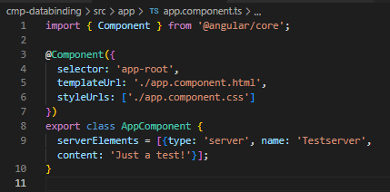
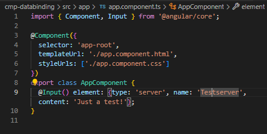
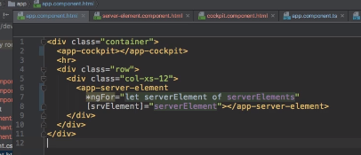
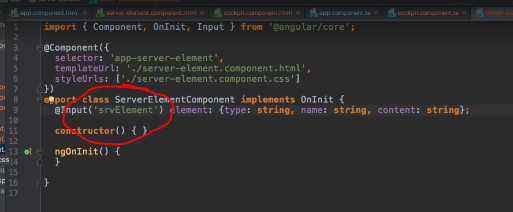
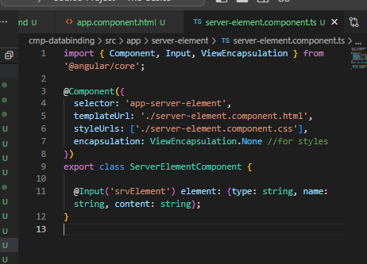
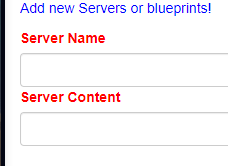
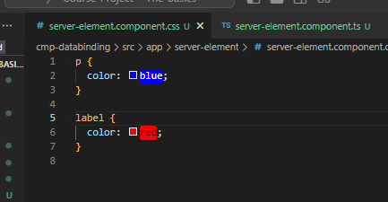
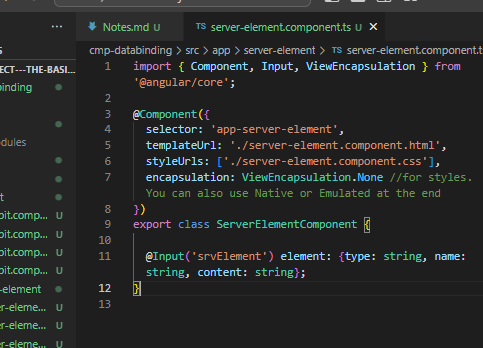
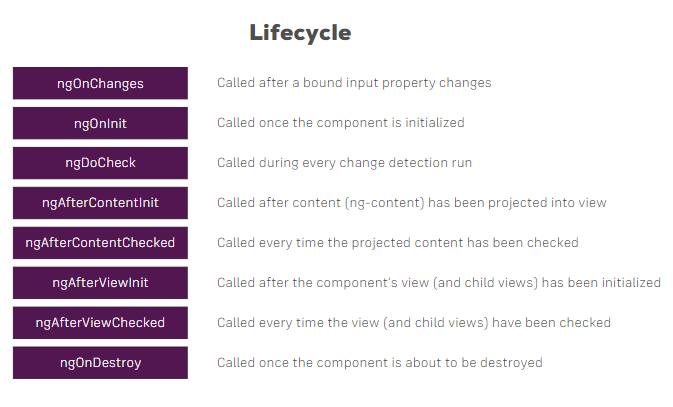
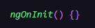

### Splitting Apps into Components

Got the SRC from the download template!

### Property & Event Binding Overview

Can use property and event binding on HTML elements, directives (ng class and style), and we can use it on our own components and make our own events (in this next section) 

### Binding to Custom Properties

Key value pairs
Not type definitions (on right side of equal sign)

{key:value}

Why can't we access element from ts to js? By default all properties of components are only accessable inside these com not from outside. You don't want to make all your properties bindable from outside. Need to be explicit to which you make public. Parent to be able to bind to this property, need to add a decorator.

Add decorator to property ts file!

From this

to this

### Assigning an Alias to Custom Properties

If you implement THIS component, you now have to target the srvElement if you want to bind to this property. Element will not work it must be the alias. 

If you want to assign an alias to a component outside the property name, this is how.

### Binding to Custom Events

***

### Understanding View Encapsulation

Angular enforces this style encapsulation, by giving the same attribute to all attributes in a component. Does this for each component with unique attribute names. Can make sure once it's changed your style selector that these styles are only complied to elements of that component. 

Emulates the "shadow DOM". Each element has it's own shadow DOM applied to it, can connect it's own style to each element.

So... it's like a mom with triplets who decides to give each kid a the same color onsie.

### More on View Encapsulation

So EVERY one of the elements, except this one, will follow the automatic stylings of Angular. This one that was excluded will be applied globally... but for certain content that was overrided.

For example, the headers here

### Using Local References in Templates

In the cockpit ts and html you can pass references instead of a broad one, more specific ones where the server elements are being created in the HTML and TS files.

Removing the two-way binding

  [(ngModel)]="newServerName"

### Getting Access to the Template & DOM with @ViewChild

In Angular 8+, the @ViewChild() syntax which you'll see in this lecture needs to be changed slightly:

Instead of:

  @ViewChild('serverContentInput') serverContentInput: ElementRef;

use

  @ViewChild('serverContentInput', {static: true}) serverContentInput: ElementRef;

The same change (add { static: true } as a second argument) needs to be applied to ALL usages of @ViewChild() (and also @ContentChild() which you'll learn about later) IF you plan on accessing the selected element inside of ngOnInit().

If you DON'T access the selected element in ngOnInit (but anywhere else in your component), set static: false instead!

For projects using Angular 9 or higher (check the package.json file to find out), you can omit static: false, you only need to specify static: true if you plan on using the selected element inside of ngOnInit().

***********************

*Use string interpolation or property binding if you want to access the DOM! Don't directly mess with any elements, even if they are directly in Angular*

### Projecting Content into Components with ng-content

Fix for the error was adding "ElementRef" to the import from Angular

### Understanding the Component Lifecycle

THIS! The ngOnInIt...

#### Different Lifecycles

**ngOnChanges**
First hook we can hook into, can be executed at mult times. Executed right at start. Properties decorated with at input

**ngOnInIt**
Angular will call on a hook. This method is called once the component is initialized (ngOnInIt). Object was created, will run AFTER the constructor. Object created, and properties can now be accessed.

**ngDoCheck**
Run multiple times, executed a lot, run whenever change detection runs. Any time a change in a component happens, updates to change in template. An event, Angular needs to check even if nothing happens

Is great if there's something you want to check on every change detection cycle

**ngAfterContentInIt**

This is called whenever the content which is projected by ngcontent has been initialized, the view of the parent component, which is added to our component through ng-content

**ngAfterContentChecked**

Executed whenever change detection checks this content

**ngAfterViewInIt**

Once the view of our own component has finized inistializing, once view is intialized

**ngAfterViewChecked**

Called every time the view (and child views) have been checked

**ngOnDestroyed**

Set to false components, calls when the component is going to be destroyed by Angular

### Seeing Lifecycle Hooks in Action

