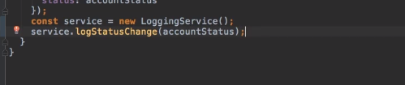
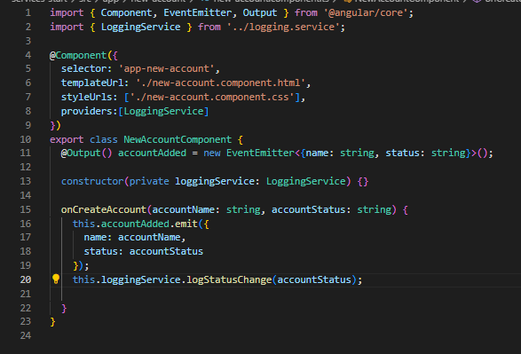

# Using Services & Dependency Injection

We are going to learn how services help with passing data, into a more complex app and what to look out for.

## Creating a Logging Service

Don't do this. Because A provides a better way of getting access to your services. Dont create the instances manually! Using a dependency Injector

## Injecting the Logging Service into Components

Dependency = something a class of ours will depend on

Think about who gives us the instance of this account component. This is a type class, so somewhere it needs to be instanciated. Angular is in charge, comes across selectors, gives us instance of our components

SO have Angular create it for you! Injecting the service from Angular.
