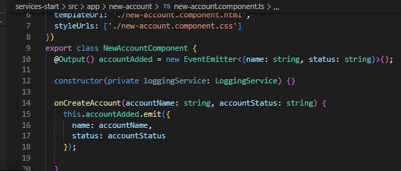

# Using Services & Dependency Injection

We are going to learn how services help with passing data, into a more complex app and what to look out for.

## Creating a Logging Service

Don't do this. Because A provides a better way of getting access to your services. Dont create the instances manually! Using a dependency Injector

## Injecting the Logging Service into Components

Dependency = something a class of ours will depend on

Provide = we tell Angular how to create a property [LoggingService]

Think about who gives us the instance of this account component. This is a type class, so somewhere it needs to be instanciated. Angular is in charge, comes across selectors, gives us instance of our components

SO have Angular create it for you! Injecting the service from Angular. Logging the centralized service (setting an account to active/inactive). Code is a BIT leaner... less repetitiveness

## Creating a Data Service

I have an error now... so we are using services incorrectly. Need to fix this in next section.

## Understanding the Hierarchical Injector

This component and it's children will recieve the same instance of this service. Can put service in other places too...

## How many Instances of Service Should It Be?

*Update: that error was fixed in a step of deleting some old content*

So you can inject things into other things, AND you can communicate between components through a service! Remember to use the right amount of instances!

## Services in Angular 6+

If you're using Angular 6+ (check your package.json to find out), you can provide application-wide services in a different way.

Instead of adding a service class to the providers[] array in AppModule , you can set the following config in @Injectable() :

  @Injectable({providedIn: 'root'})
  export class MyService { ... }

This is exactly the same as:

  export class MyService { ... }

and

  import { MyService } from './path/to/my.service';
  @NgModule({
      ...
      providers: [MyService]
  })
  export class AppModule { ... }

Using this new syntax is completely optional, the traditional syntax (using providers[] ) will still work. The "new syntax" does offer one advantage though: Services can be loaded lazily by Angular (behind the scenes) and redundant code can be removed automatically. This can lead to a better performance and loading speed - though this really only kicks in for bigger services and apps in general.

## Assignment: Services

